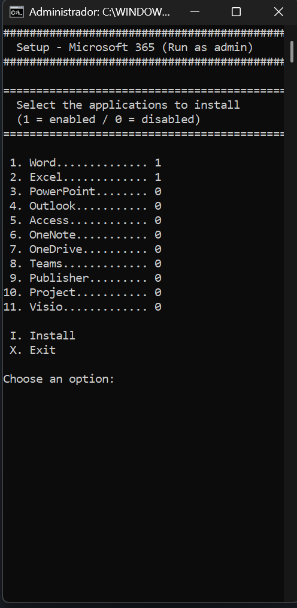
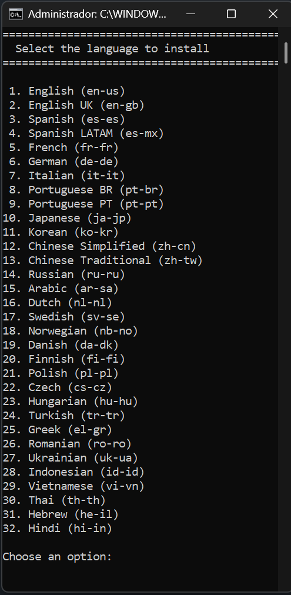

<!-- Badges - Replace projectName with the name of the project also, change or add the link-->

---

# Microsoft 365 - Batch Installer

This is a customizable, interactive, and user‑friendly batch‑based installer for [Microsoft 365](https://learn.microsoft.com/en-us/microsoft-365-apps/deploy/about-microsoft-365-apps). 
The script is released under the [MIT License](./LICENSE.md), while Microsoft Office is covered by its own [Microsoft license](https://www.microsoft.com/en-us/microsoft-365/business/microsoft-365-plans-and-pricing).

---

## Features

- Selectable Office Apps to install.
- Selectable language for Office Apps.
- Download and installs only the Apps you choose.

#### Predefined Settings (Non modifiable)

- Architecture: x64  
- Product: O365ProPlusRetail  
- Channel: Current  
- Updates: Enabled  
- EULA: Accepted  

> **Note**  
> The script will install **Enterprise Edition** using **Current Channel** and **x64 architecture**.  
> The user's **Microsoft 365 subscription automatically determines the final edition** (Personal, Family, Student, Business, Enterprise) **and may switch the update channel** after activation if required.

---

## How to install - Microsoft Office 365

### Using Setup-M365.bat Installer (The easiest way)

This method allows you to interactively select which Office applications and language to install.

**First steps:**

1. Download and extract the files from the latest release of [Setup-M365.zip](https://github.com/Astorcamon/Office-M365-Batch-Installer/releases/latest)
2. Download and run the official [Office Deployment Tool (ODT)](https://www.microsoft.com/en-us/download/details.aspx?id=49117)  
3. Copy `Setup.exe` to the same folder as `Setup-M365.bat`

**Next steps:**

1. Run `Setup-M365.bat` **as Administrator**.
2. Select the applications to install by entering their number and press Enter.
   - Each application shows its status as **=1 (Enabled)** or **=0 (Disabled)**.
3. Enter **I** to begin the installation.
4. Select the language to install by entering its number and press Enter.

---

## Alternative methods

 Click here to expand

### Using ODT (The official method)

This method uses Microsoft’s official configuration and deployment workflow.

**First steps:**

1. Download and run the official [Office Deployment Tool (ODT)](https://www.microsoft.com/en-us/download/details.aspx?id=49117)

**Next steps:**

1. Generate a custom XML configuration using the online [Configuration Tool](https://config.office.com/deploymentsettings)
2. Save the generated XML file in the same folder as `setup.exe`.
3. Open **Command Prompt as Administrator** in that folder.
4. Download the Office installation files: `setup.exe /download configuration.xml`
5. Once the download completes, install Office: `setup.exe /configure configuration.xml`

Learn more: https://learn.microsoft.com/en-us/microsoft-365-apps/deploy/deploy-microsoft-365-apps-cloud

### Using OTP (The AIO Tool for Office)

The Office Tool Plus integrates Microsoft’s official deployment workflow into a third‑party tool with a full graphical UI and more features.

Learn more: https://www.officetool.plus/

---

## Screenshots

 

---

## Contributions

<Table>
   <th>PayPal</th>
   <th>GitHub</th>
   <th>Ko-Fi</th>
  <tr>
    <td></td>
    <td></td>
    <td></td>
  </tr>
</table>

